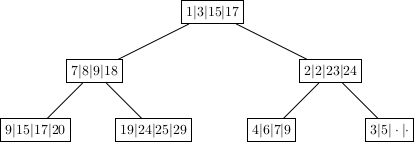
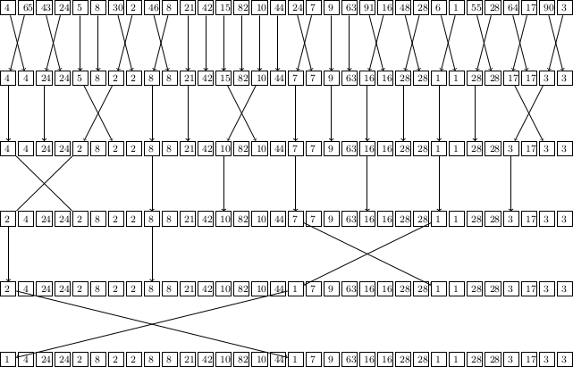
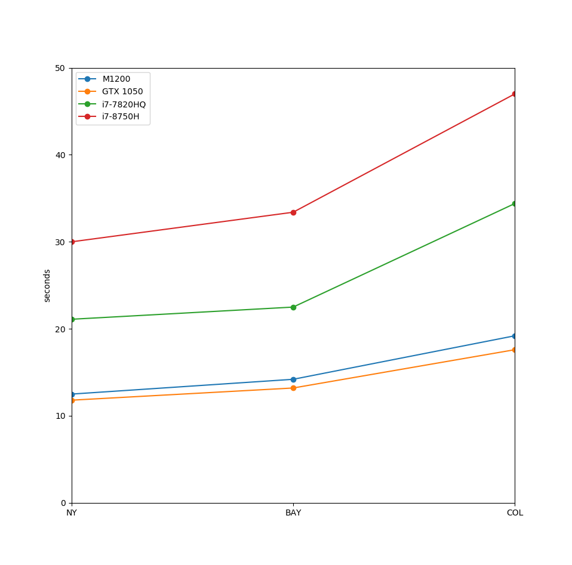

# CUPQ: a CUDA implementation of a Priority Queue applied to the many-to-many shortest path problem

[](download BibTex citation)

This tiny library implements a priority queue in CUDA, the goal (besides showing the data structure and its implementation) is to compare it with the best CPU implementation we know
 (from Boost or the STL) on a Dijkstra algorithm benchmark. I used for comparison the GPUs in my laptops (here we show results with a Maxwell M1200 and GeForce GTX 1050 Mobile GPUs).
We assume it's fair to compare them with a single core of a high-end multicore CPU (in this case i7-7820HQ CPU). In fact a gaming GPU such as the GTX 1080 would have approximately 
4 times the hardware and memory bandwidth compared to these laptop GPUs, and also the prices of the GTX 1080 and the multicore processor i7-7820HQ are approximately matching (around 400$).

For benchmarking purposes we use a publicly available road networks database ```http://users.diag.uniroma1.it/challenge9/download.shtml```.
The problem we are addressing is the simultaneous computation of the shortest paths from thousands of origins to all the nodes of the graph.

## Quick start

run CMake to configure the project
```
> mkdir build;
> cd build; cmake -DCOMPUTE_CAPABILITY=61 -DTIMINGS -DCPU_COMPARISON -DCMAKE_BUILD_TYPE=RELEASE ..
```
where you have to input the compute capability of your NVidia graphic card without the intermediate point (for the GTX 1050 Mobile the compute capability is 6.1).

Download a couple of input graphs to run the examples
```
> make download_grahs
```

build the examples
```
> make -j
```

Run the shortest paths benchmark
```
> ./dijkstra_simple_exe -g USA-road-d.NY
```

This benchmark will select randomly origins and destinations and execute the algorithm. You can set the number of origins/destinations by editing the file examples/dijkstra_simple/main.cpp.

## Heap Data Structure

The basic idea of this CUDA implementation of the many-to-many shortest path problem consists in assigning a heap-based priority queue to each CUDA *warp*.
The heap is a balanced tree data structure which satisfies the *heap property*: the value of the parent node is smaller than or equal to the value of the children.

Actually we don't really use a traditional heap: we replace the nodes in the heap with sorted arrays
of 32 items, where an item is a pair containing a value (32 bit floating point number representing the distance from the destination) and a key (32 bit integer identifiyng the node in the graph).
These arrays of items are sorted in increasing order with respect to the item's values,
and the value of the smallest item in each array is satisfying a *heap-like property*: the first element of
each array has smaller cost than the first element of it's children's first element.
We call such first elements the *top* elements of each array.

If you are confused after this explanation look at the clarifying picture below:



The two basic operations performed in a heap are:
- *pop*: extraction of the minumum element (the top item in the root array), then in order to fill the empty slot the last element of the heap is moved to the top position in the root array. The change is then propagated down the tree until the heap property is recovered;
- *insert*: a new element is inserted at the bottom of the heap, adding a new child if necessary (but keeping the tree balanced), otherwise filling an empty slot in an existing array (and maintaining the order whithin the array), then the change is propagated up until the heap property is recovered.

Each thread in the warp is *responsible* of one value in the arrays. To keep the array sorted, when doing operations like extracting the minimum, or inserting a new element, 
the threads have to compare and shuffle their own value with each other, and that's
roughly where the GPU ballot, vote, and shuffle instructions come into play (in device/haep.h ). With this idea we exploit at best the memory bandwidth, 
since all threads are accessing their own element in the array concurrently, and they communicate through the shuffle instruction. 
The operations of the Dijkstra algorithm are instead redundantly computed by all the cores in the warp.

The simplest implementation of a heap data structure would be a binary heap, as the one shown in the picture above. However increasing the heap *arity* reduces the number of hops performed to reach a given node, thus might reduce expensive memory accesses.
We choose an arity of 32, and this choice will be motivated below. We will consider thus a 32-ways heap in which each node contains 32 values, so that accessing a heap
smaller than 1056 items only requires at most one hop.

We keep the top element of each array in the fast *shared memory*, so that
each cuda thread in a warp will be able to readly access his own element of each array, and the smallest element of each array.

For this reason having a ``fat'' heap
turns out to be more efficient than a classical binary heap. In fact when we do a pop operation,
and propagate the change down the heap, we compare the cost of the parent's top item (cached in shared memory) with the top items of the children (also in shared memory),
in order to select which child array to access. Having larger arity increases the number of comparisons, but it decreases the height of the heap,
which means trading expensive local memory accesses for cheap shared memory ones. A natural choice for the arity is 32,
since we can take the minimum of 32 numbers whithin a warp in parallel, by calling 6 times the
shuffle instruction, as shown below with an example.



With the model described here each warp accesses its own priority queue, which is sitting on the
threads local
memory, so that multiple warps will execute different shortest path algorithms concurrently, computing
eventually the solution to the many-to-all shortest path problem.

# Results

Computing the Shortest Path typically involves
little computation (i.e. arithmetic operations), and a large amount of memory accesses. Algorithms with such behaviour are called
\emph{memory-bound} algorithms, since their performance is bound by the speed of the memory accesses, as opposed to \emph{compute-bound} algorithms which are limited by the
speed of the Arithmetic Logic Units (ALU) or Floating Point Units (FPU). For memory bound
 applications the computation time is often completely hidden by the latency of memory accesses, thus
improving the efficiency of the former (e.g. by choosing processors with higher clock frequency, vectorizing floating point operations, etc...) does not reflect in any improvement overall.
On the other hand one has to make sure that the available memory bandwidth utilized at best, and that the slow memory accesses are minimized,
since any small improvement there is an overall improvement.

We use the graphs USA-road-d.NY.gr (264'346 nodes and 733'846 edges), USA-road-d.BAY.gr (321'270 nodes and 800'172 edges), USA-road-d.COL.gr (435'666 nodes and 1'057'066 edges), and compute the shortest paths from 1024 random origins.



We see we get some improvement using our CUDA implementation, not astonishing, but not bad considering that GPUs are normally not best suited for graph algorithms in general. We also remark that road networks's connectivity is low when compared to other types of graphs, so the priority queue is not expected to grow very large. It would be interesting (and I'll do it when I'll have some spare time) to test how does the data structure perform in different situations, such as with social media graphs. If you have an NVidia GPU try out yourself and see what you get!

[](https://doi.org/10.5281/zenodo.3595244)
